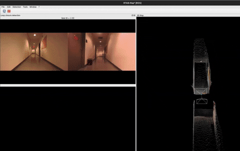

# multi-camera-superpoint-SLAM
Graph based SLAM for multiple cameras using SuperPoint feature detector. Uses (zed_wrapper, rtabmap_ros, LibTorch and ROS noetic).

  

 

## Dependencies
1) ROS
2) zed_wrapper ([Offical Guide](https://github.com/stereolabs/zed-ros-wrapper))
3) zed_ros_example ([Offical Repository](https://github.com/stereolabs/zed-ros-examples))
4) LibTorch ([Offical Installation Guide](https://github.com/pytorch/pytorch/blob/main/docs/libtorch.rst))
5) rtabmap + rtabmap_ros ([Offical Installation Guide](https://github.com/introlab/rtabmap_ros#rtabmap_ros))
6) Download SuperPoint Weights .pt file ([Offical Reposoitory](https://github.com/KinglittleQ/SuperPoint_SLAM))
